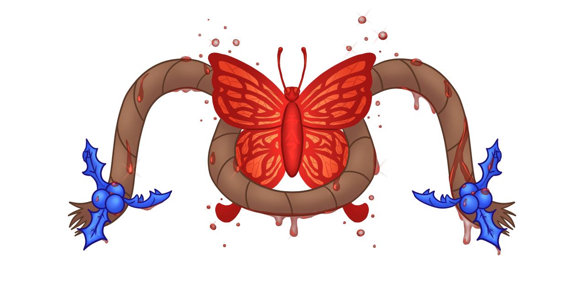

# Mikompilation
[](https://github.com/wagrenier/Mikompilation/actions/workflows/Build.yml) [](https://discord.gg/Ap4Sfcmwd9)



Decompilation project for the Fatal Frame 2 : Crimson Butterfly；Project Zero 2；<ruby>零<rt>ぜろ</rt></ruby>～<ruby>紅い蝶<rt>あかいちょう</rt> game engine. Our goal is to have a fully playable port on PC and maybe on future platforms too.

Mainly a project to learn about reversing and coding in OpenGL.

## Special Thanks
* [@MasterHimuro](https://twitter.com/masterhimuro) for doing the logo

## Build
Right now, the application only builds for `x32` due to restrictions from the game's code and memory layout.
### Linux

Run the following commands to install the required dependencies:

```shell
sudo dpkg --add-architecture i386
sudo apt install gcc-multilib g++-multilib
sudo apt-get install mesa-common-dev:i386
sudo apt-get install libglu1-mesa-dev:i386
```

## Common
Library containing all common functions needed by most libraries of the project. Contains things like vector math, configurations and printing.

## Engine
This folder contains all sources related to the game engine.

## Tools
### Argparse
Library for making cli simple

### ExportStruct
Tool to export raw values from an elf to a well formatted struct.

### Extractor
Tools for extracting game files. This tool should run before the main executable

## Third-Party
Library containing all the project's external libraries.

## UI
Library containing the source code for the UI, mostly ImGui related stuff.

## Src
Folder containing the main logic of the application.

## Game
Library containing the game's logic.
